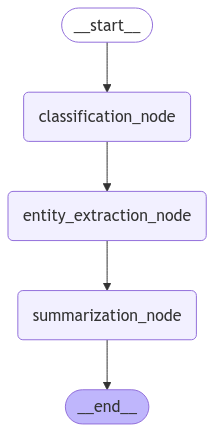
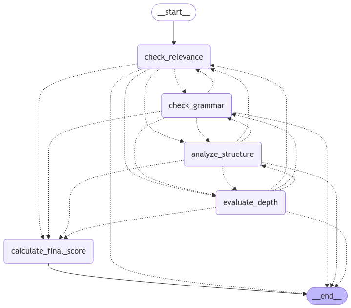

# 🧠 AI-TextEvaluator-Suite

**An advanced AI-driven application suite for automatic essay grading and intelligent text analysis.**

This repository hosts two LangGraph-powered apps built with Gradio and Groq’s blazing-fast LLMs:
- ✍️ **Essay Grading System** — Evaluate essays on Relevance, Grammar, Structure, and Depth with an aggregated Final Score.
- 🧾 **Text Analysis Tool** — Classify text, extract key entities, and summarize content in seconds.

Built for students, researchers, educators, and content analysts

---

## 📂 Project Structure

```
AI-TextEvaluator-Suite/
│
├── essay_grading_app.py           # Essay evaluation app using LangGraph + Groq
├── text_analysis_app.py           # Text classification and summarization app
├── .env                           # Store your GROQ_API_KEY here
├── requirements.txt               # Required Python dependencies
├── Assets/
│   ├── Screenshot_1.png     # Screenshot of the Text Analysis app
│   ├── Screenshot_2.png     # Screenshot of the Essay Grading app
│   ├── text_analysis_workflow.png # LangGraph flow for text analysis
│   └── essay_grading_workflow.png # LangGraph flow for essay scoring
└── README.md                      
```

---

## 🧪 Features

### ✍️ Essay Grading System
- Analyzes essays on:
  - ✅ **Relevance**
  - ✅ **Grammar**
  - ✅ **Structure**
  - ✅ **Depth of analysis**
- Uses conditional branching logic for efficient scoring.
- Returns individual scores and a weighted **Final Score**.

### 🧾 Text Analysis Tool
- 🗂 **Classification**: Detects whether input is News, Blog, Research, or Other.
- 🧠 **Entity Extraction**: Identifies People, Organizations, and Locations.
- 📄 **Summarization**: Compresses the text into a concise sentence.

---

## 🖼️ Screenshots

### 📊 Text Analysis with LangGraph


---

### 📝 Essay Grading System


---

## 🧭 Workflow Diagrams

### 🔄 Text Analysis Workflow (Linear)

This app processes your input through a simple, linear flow — perfect for structured insights on short text content.



---

### 🧠 Essay Grading Workflow (Conditional Graph)

This app uses **conditional logic** to decide how deep to analyze your essay, optimizing compute efficiency and feedback quality.



---

## 🛠️ Tech Stack

- 🧩 **LangGraph** — Declarative AI workflows built with LangChain
- 🧠 **Groq LLMs** — Ultra-fast, open-weight large language models
- 🖼️ **Gradio** — Interactive UI for quick testing
- 🔐 **python-dotenv** — Secure environment variable management

---

## 🔧 Installation

1. **Clone the repo**
```bash
git clone https://github.com/Electrolight123/AI-TextEvaluator-Suite.git
cd AI-TextEvaluator-Suite
```

2. **Install dependencies**
```bash
pip install -r requirement.txt
```

3. **Set up `.env`**
```env
GROQ_API_KEY=your_groq_api_key_here
```

4. **Run the apps**
```bash
python essay_grading_app.py        # For essay grading
python text_analysis_app.py        # For text classification and summary
```

---

## 🌐 Future Enhancements
- 🔄 Add feedback suggestions per score
- 🧾 Downloadable PDF reports
- 🌍 Deploy on Streamlit Cloud / HuggingFace Spaces
- 🧩 Support for additional NLP tasks (tone analysis, keyword extraction, etc.)

---

## 🤝 Contributing

Contributions are welcome! Open an issue or submit a pull request.

---

## 📄 License

MIT License — free to use, modify, and distribute.

---

## 💡 Inspiration

This suite was built to demonstrate the capabilities of modern open-weight LLMs for real-world NLP workflows, and make essay evaluation & text comprehension more accessible and intelligent.

---

## ✨ Made with ❤️ by Abhishek bala


